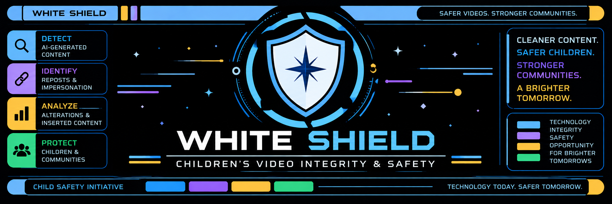
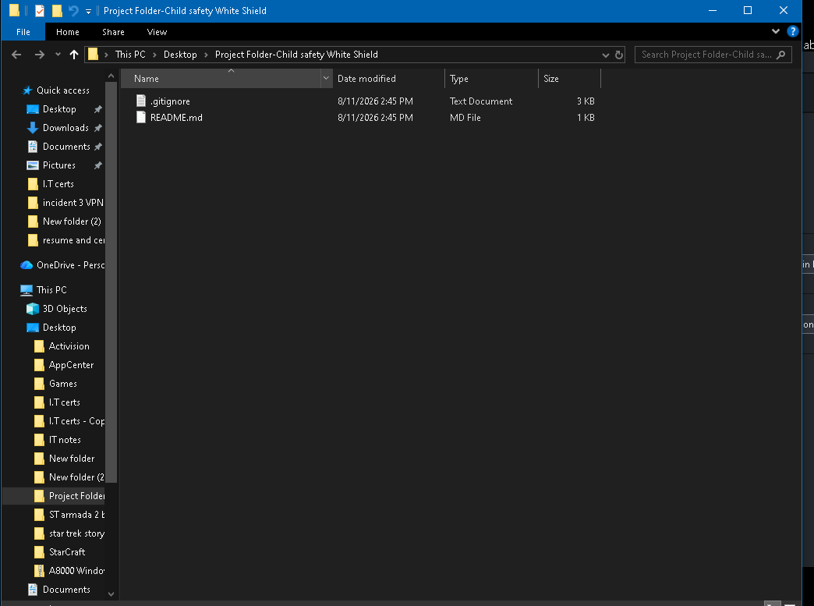
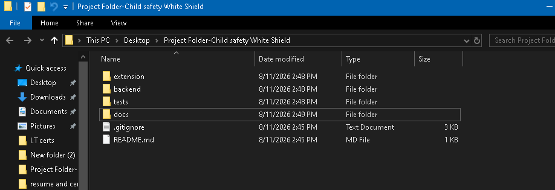
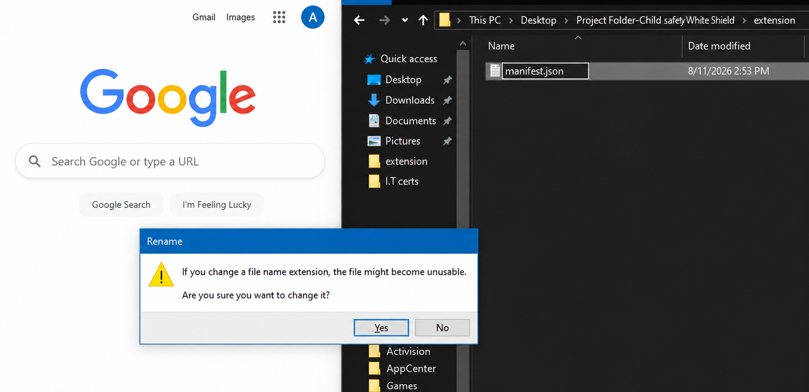
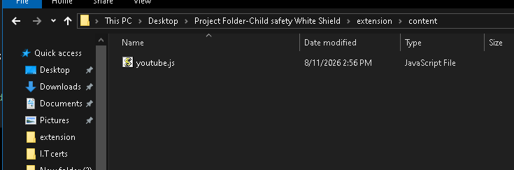

  

# What is White Shield? 

Chrome Extension to detect videos on Youtube for AI intergration, repost from original creator and scan for any inserted portions that may contain alterations to original video

# Why was this created? 

As a father, I found more and more videos my children viewed to be made with AI or a video of a known popular creator to be reposted by a different poster and then running into the danger of having my children watch an edited video with something dangerous or potentially something meant for an older audience to be placed in the middle of the video and shown to them. Naturally this caused a worry for myself and I searched for any active filters that can monitor and inform me about videos that could have these issues. I come to find out that in this day and age of AI and everything being ran through the internet, there is not really anything like what I have been looking for in the market yet. 

And so, I decided to create something for my own children, for their safety to watch what they are meant to watch specifically on Youtube and have it actively monitor each video playing for these subjects that i pointed out. 

What I want this extension to accomplish is as follows,

1. Notify me when a AI video is detected.
2. Verify video quality and authenticity and if it is reposted by another creator, to notify me that this video "looks like it came from a different creator"
3. Monitor actively each video every 6-10 seconds for any alterations that maybe inserted if the video is a repost from an original creator

these are the hard wants of this extension to become, but all of these points come with big challenges to overcome. 
This is my journey. 

I have taken a long time to  write, test and push my code making sure everything is correct and while I have used AI to assist in checking on my script. I can admit I have done this old school with many many hours of YouTube and good o' research. This is still a work in progress but I have currently made a functioning beta extension that has specific permission to only read YouTube videos you play and make sure it can detect exactly what video it is. 

# Accomplished

🔵 **Chrome Manifest V3 extension prototype**  
🔵 **YouTube-first browser integration**  
🔵 **Restricted YouTube host permissions**  
🔵 **Minimal Chrome permission model**  
🔵 **Current YouTube video detection**  
🔵 **YouTube single-page navigation support**  
🔵 **Video ID, title, channel & URL extraction**  
🔵 **White Shield extension popup**  
🔵 **Popup ↔ content-script messaging**  
🔵 **Active YouTube `<video>` element access**  
🔵 **Live in-browser video frame capture**  
🔵 **Frame resolution & timestamp capture**

# Next up to test

🟣 **Timeline frame sampling** —   
🟣 Child-directed content identification  
🟣 Unsafe inserted-segment classification  
🟣 AI-generated visual content detection  
🟣 Synthetic / AI voice detection  
🟣 Creator identity verification  
🟣 Repost / near-duplicate detection  
🟣 Original-vs-repost timeline comparison  
🟣 Inserted / altered segment detection  
🟣 Video fingerprinting  
🟣 Content Credentials / provenance checks  
🟣 Explainable confidence scoring  
🟣 Ahead-of-playback safety warnings — FUTURE GOAL!! 

# Organization  

 As I organize my photos for this project I will be updating all my steps without any code. Most of my time is spend on my Private Repo, This is so you can follow my Journey. 

# The start of the Journey

After connecting my GitHub to my Desktop App and creating a folder to start the process, it looked like this. 

  

  

# Next I created the folders that I needed based on the research I did in order to start creating the script using notepad and making sure you delete the .txt file name that is usually hidden in the end. 

# At this point I needed to create a .json file
Now to see your notepad hidden file extension, you must click view on the top of the window (where it says file, home, Share, View) and then when it turns into a box of clickable settings you must click on file name extensions in order to be able to see the actual end of the .txt and then delete it. A warning box will pop up, and that is expected. It should look like this .

  

After completing the .json file, I needed to repeat the text file in the contents folder for the .js file (JavaScript)
Now betweeen the .json file and this .js file there is code you must write, I am not skipping it but because it is a work in progress the code is private in my other Repo and I will not be sharing it. Although with research you can easily create or even use already public formats of these codes. I had a lot of trial and error writing these using what i found as reference. Anyways this is the file and what it looks like when changed and make sure to delete the .txt end name 

  

## Source Availability

White Shield is under active development. The production source code and detection pipeline are maintained in a private repository. This public repository provides project documentation, demonstrations, architecture overviews, and development progress.
